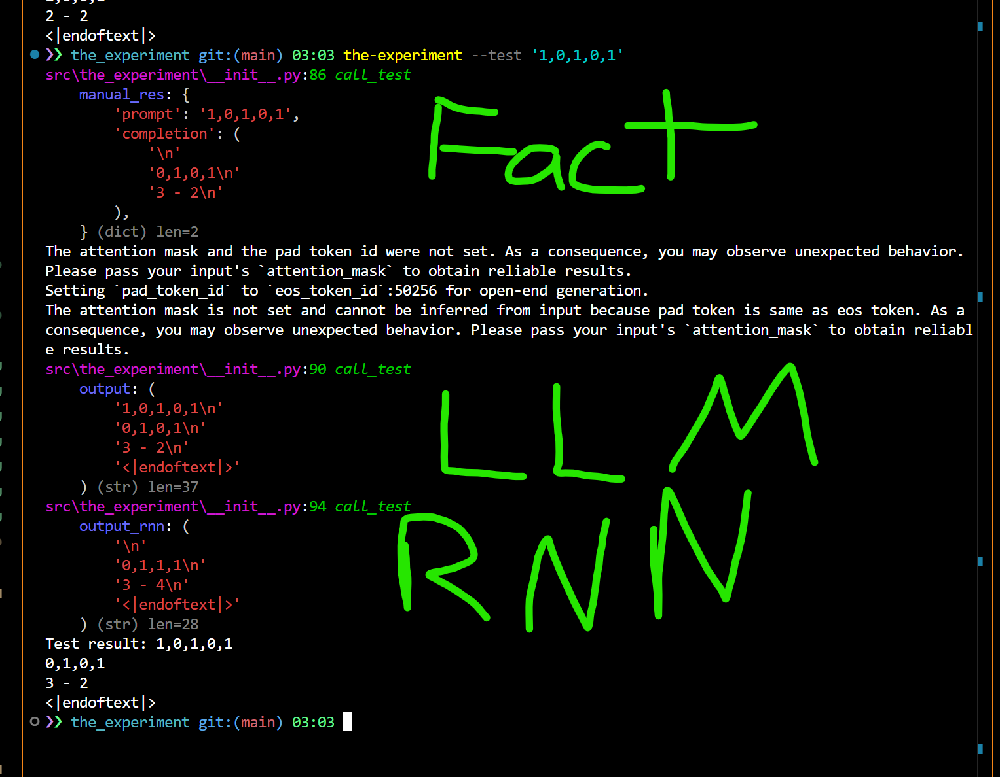
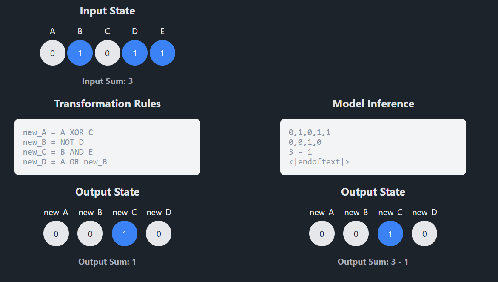

# Causal Reasoning Experiment

This project implements a causal reasoning experiment using a small GPT-2 model to learn structural equations and predict state changes in a system/'world' of boolean variables and basic arithmetic. 

You can remove sequences from the training data and test how the LLM behaves on data it never saw during training.

- Will it learn rules for the sequences it has seen?
- Will it learn rules for the sequences it has not seen?

This is for you to try out!

Hopefully it hints at an LLM indeed building up a causal world model that goes beyond pattern matching.

#### **TL;DR**

A model learns rules and predicts outcomes based on these rules. The cool stuff: it works on new data it hasn't seen before and can handle multi-step dependencies (a part of the output depends on the output itself), suggesting f*ck the parrots and their handlers 

## Overview

The experiment models a system of 5 boolean variables (A, B, C, D, E) with the following structural equations and rules:

```
newA = A XOR C
newB = NOT D
newC = B AND E
newD = A OR newB

sum(A+B+C+D+E) - sum2(newA+newB+newC+newD)
```

The model learns to predict how the states of newA, newB, newC and newD update given an initial state configuration.

Note, that for newD and sum2 the system can't infer it directly from the input without 'knowing' the rules, since sequential dependency (newD depending on newB) is not trivial, especially if it's sequential dependency in the output itself.

example

`{"prompt": "0,1,1,1,0", "completion": "\n1,0,0,0\n3 - 1\n"}`

```
A = 0
B = 1
C = 1
D = 1
E = 0

newA = A XOR C      -> 1
newB = NOT D        -> 0
newC = B AND E      -> 0
newD = A OR newB    -> 0

sum(A+B+C+D+E) - sum2(newA+newB+newC+newD) -> 3 - 1

```

Each example in the dataset consists of:
- Input: Initial states of variables A,B,C,D,E as comma-separated binary values
- Output: Updated states of newA,newB,newC,newD followed by the sums

Example:
```
Input: "1,0,1,0,1"
Output: "0,1,0,1\\n3 - 3"
```


## How do I use this?

### Installation like a CTO

```bash
pip install the-experiment

the-experiment --generate -o '1,1,1,1,1;0,0,0,0,0'
```

(Don't forgert to call IT afer every step and ask questions like 'Where is the model?')

### Installation like a software engineer

https://docs.astral.sh/uv

```bash
git clone thishit
cd the-experiment

uv sync && uv build && uv pip install -e .

the-experiment --generate -o '1,1,1,1,1;0,0,0,0,0'
```

### Installation like a computer scientist 

```bash
# Clone the repository
git clone thishit
cd the-experiment

# Install dependencies
pip install -r requirements.txt
python -m venv .venv

#activate venv
source .venv/bin/activate # Mac+Linux
.venv\Scripts\activate  # Win

python ./src/the_experiment/__init__.py --generate -o '1,0,1,0,1'
```


### Generate dataset

```bash
 # Generate complete dataset
the-experiment --generate
# Generate dataset excluding specific sequences
# seperated by ;
the-experiment --generate -o '1,1,1,1,1;0,0,0,0,0'  
```

This will create:
- `dataset/train.jsonl` (20,000 examples)
- `dataset/valid.jsonl` (2,000 examples)
- `dataset/test.jsonl` (2,000 examples)

In this example:

```bash
the-experiment --generate -o '1,0,1,0,1'
```


### Train

Train the GPT-2 model on the generated datasets:

```bash
the-experiment --train
```

The trained model will be saved in `out/tiny-gpt2-causal/final/`.


```bash
the-experiment --train_rnn
```

```bash
the-experiment --train_cnn
```

will train a RNN and a CNN to compare behavior with the LLM

### Test (sequence in dataset)

Test the model with a specific input sequence:

```bash
the-experiment --test '0,0,1,1,1'
```

First part of the output is calculated by code

Second part generated by the LLM (see green)


### Test (sequence not in dataset)

```bash
the-experiment --test '1,0,1,0,1'
```


Marvel at this shit, and shove it up the luddites and their parrots.
Even removing three different sequences are no problem. Feel free to push it to the limit.

if you have a trained RNN oder CNN, the output will include those



Nothing to see here... just a RNN with 7 times the size of the LLM can't figure out the rules of the missing sequences (20% of sequences missing completely in the training data, gpt2 still taking it like a champ)

The rnn struggles hard with the output dependent rules, since pattern matching doesn't help here


### Test UI

```bash
the-experiment --testui
```

If you are more the clicking type, this is for you




## Model Architecture

The project uses a small GPT-2 model with:
- 128 embedding dimensions
- 4 layers
- 4 attention heads
- Trained for 3 epochs
- Learning rate: 5e-4
- Batch size: 16


## Logging

The experiment uses loguru for comprehensive logging:
- Console output with colored formatting
- Log files stored in `logs/` directory
- Rotation: 100MB file size
- Retention: 10 days

## Creating your own rules

Inside `dataset.py` change up `generate_example()` however you want.


Don't forget to implement the same rules in `manual_test()` which is the code used for evaluating your input by code when using `--test`


## Troubles

If you experience cuda shenanigans put your CUDA version in `pyproject.toml`

```
[tool.uv.sources]
torch = { index = "pytorch" }
torchvision = { index = "pytorch" }


[[tool.uv.index]]
name = "pytorch"
url = "https://download.pytorch.org/whl/cu124"   <- change this to cu121 if you use 12.1 for example
explicit = true
```

Or just remove above blocks from the file to let your system and your python cache decide. Sometimes it works

## FAQ

- Is this hard proof for metaphysical shenanigans, real understanding?

What do I know? I'm just a software architect, and it's the weekend, so I won't bother our research guys with my shit... but probably not, really.
You’d have to do some serious mathematical pre-work to show that reverse-engineering rules of this is complex enough. You’d likely need to build up a more complex rule set and then demonstrate why this rule set works as serious evidence while others don’t. I’m not the guy for this shit.

But one thing you can prove with it: “LLMs only know things in the training data” is wrong—if you have something not in the training data that the model can solve.

Also, it’s probably not that hard to imagine, that if a reduced GPT-2 model can solve these sequences, a 400B parameter SOTA model will likely learn things in completely different dimensions. Think of this experiment as a kind of thought game: reducing the complexity of a 'real' model into something you can still intuitively grasp and understand and just f*ck around with.

Feel free to experiment with the rules in this setup. Maybe you’ll find a set of really complex stuff that still works? Let me know!

- What comes next?

I’ve always wanted some kind of LLM playground where you can do small experiments like these and play with them, get analyses, like weight activation heat maps or whatever, and have some manipulation tools. For example: What happens if you flip some weights mid-inference? Or What changes if you nuke part of the model? Then you could see how the model adapts.
Of course, I’d include bleeding-edge stuff too... like trying out rStar or experimenting with ways to imprint other kinds of "thinking processes" into an LLM, instead of just relying on CoT reasoning all the time. Like what happens if you not distill COT into an LLM, but the ReAct pattern? Plenty of ideas for an experiment kit.

Also, I promised the localllama sub I’d make them a virtual anime waifu with infinite context.

So yeah, I’ll probably build some UI around this and slowly add features to it.


## Discord

If you want me to read you pls 
https://discord.gg/PSa9EMEMCe

I will literally check nothing else. no mail, no github issues, no reddit messages.

## License

MIT, but if you write a paper referencing this repo some mention would be nice