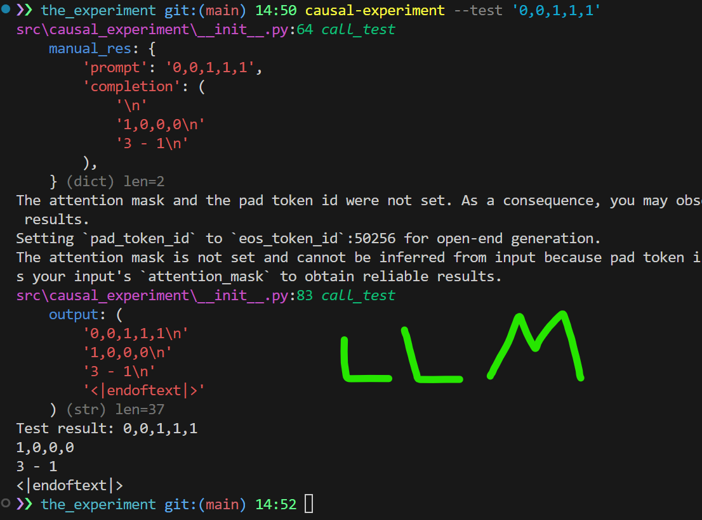

# Causal Reasoning Experiment

This project implements a causal reasoning experiment using a small GPT-2 model to learn structural equations and predict state changes in a system/'world' of boolean variables and basic arithmetic.

Hopefully it shows that an LLM indeed builds up a causal world model that goes beyond pattern matching.

#### **TL;DR**

A model learns rules and predicts outcomes based on these rules. The impressive part: it works on new data it hasn't seen before and can handle multi-step dependencies (a part of the output depends on the output itself), suggesting f*ck the parrots and their handlers 

## Overview

The experiment models a system of 5 boolean variables (A, B, C, D, E) with the following structural equations and rules:

```
newA = A XOR C
newB = NOT D
newC = B AND E
newD = A OR newB

sum(A+B+C+D+E) - sum2(newA+newB+newC+newD)
```

The model learns to predict how the states of newA, newB, newC and newD update given an initial state configuration.

Note, that for newD and sum2 the system can't infer it directly from the input without 'knowing' the rules, since sequential dependency (newD depending on newB) is not trivial, especially if it's sequential dependency in the output itself

example

`{"prompt": "0,1,1,1,0", "completion": "\n1,0,0,0\n3 - 1\n"}`

```
A = 0
B = 1
C = 1
D = 1
E = 0

newA = A XOR C      -> 1
newB = NOT D        -> 0
newC = B AND E      -> 0
newD = A OR newB    -> 0

sum(A+B+C+D+E) - sum2(newA+newB+newC+newD) -> 3 - 1

```

Each example in the dataset consists of:
- Input: Initial states of variables A,B,C,D,E as comma-separated binary values
- Output: Updated states of newA,newB,newC,newD followed by the sums

Example:
```
Input: "1,0,1,0,1"
Output: "0,1,0,1\\n3 - 3"
```


## How do I use this?

### Installation like a software engineer

https://docs.astral.sh/uv

```bash
git clone thishit
cd causal-experiment

uv sync
uv build && uv pip install -e .

causal-experiment --generate -o '1,1,1,1,1;0,0,0,0,0'
```

### Installation like a computer scientist 

```bash
# Clone the repository
git clone thishit
cd causal-experiment

# Install dependencies
pip install -r requirements.txt
python -m venv .venv

#activate venv
source .venv/bin/activate # Mac+Linux
.venv\Scripts\activate  # Win

python ./src/causal_experiment/__init__.py --generate -o '1,0,1,0,1'
```


### Generate dataset

```bash
causal-experiment --generate  # Generate complete dataset
causal-experiment --generate -o '1,1,1,1,1;0,0,0,0,0'  # Generate dataset excluding specific sequences
```

This will create:
- `dataset/train.jsonl` (20,000 examples)
- `dataset/valid.jsonl` (2,000 examples)
- `dataset/test.jsonl` (2,000 examples)

In this example:

```bash
causal-experiment --generate -o '1,0,1,0,1'
```


### Train

Train the GPT-2 model on the generated datasets:

```bash
causal-experiment --train
```

The trained model will be saved in `out/tiny-gpt2-causal/final/`.


### Test (sequence in dataset)

Test the model with a specific input sequence:

```bash
causal-experiment --test '0,0,1,1,1'
```

First part of the output is calculated by code

Second part generated by the LLM (see green)




### Test (sequence not in dataset)

```bash
causal-experiment --test '1,0,1,0,1'
```


Marvel at this shit, and shove it up the luddites and their parrots.


## Model Architecture

The project uses a small GPT-2 model with:
- 128 embedding dimensions
- 4 layers
- 4 attention heads
- Trained for 3 epochs
- Learning rate: 5e-4
- Batch size: 16


## Logging

The experiment uses loguru for comprehensive logging:
- Console output with colored formatting
- Log files stored in `logs/` directory
- Rotation: 100MB file size
- Retention: 10 days

## Creating your own rules

Inside `dataset.py` change up `generate_example()` however you want.


Don't forget to implement the same rules in `manual_test()` which is the code used for evaluating your input by code when using `--test`


## Troubles

If you experience cuda shenanigans put your CUDA version in `pyproject.toml`

```
[tool.uv.sources]
torch = { index = "pytorch" }
torchvision = { index = "pytorch" }


[[tool.uv.index]]
name = "pytorch"
url = "https://download.pytorch.org/whl/cu124"   <- change this to cu121 if you use 12.1 for example
explicit = true
```

Or just remove above blocks from the file to let your system and your python cache decide. Sometimes it works

## Discord

If you want me to read you pls 
https://discord.gg/PSa9EMEMCe

I will literally check nothing else. no mail, no github issues, no reddit messages.

## License

MIT